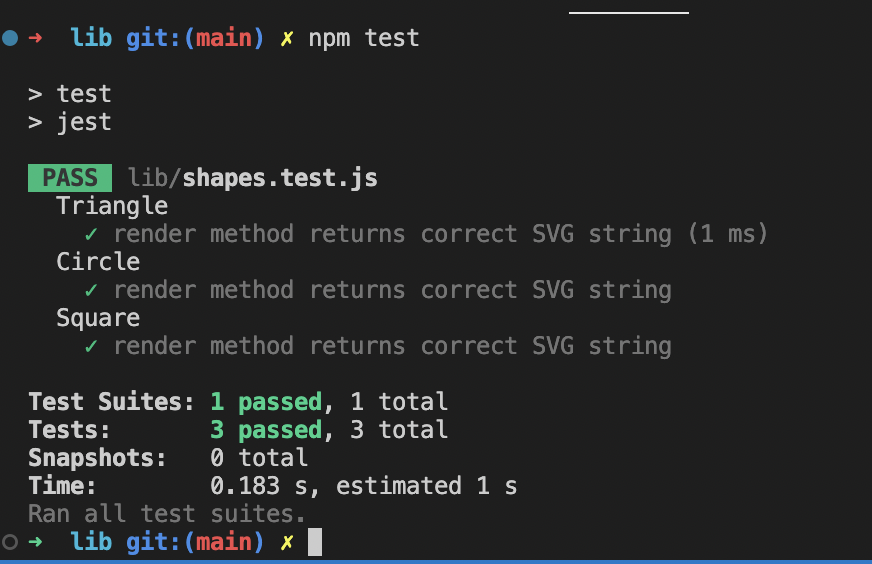
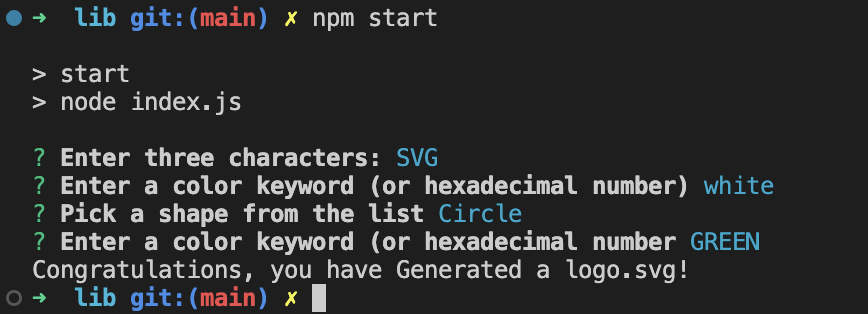

# LOGO_SVG
```md
AS a freelance web developer
I WANT to generate a simple logo for my projects
SO THAT I don't have to pay a graphic designer
```

## Acceptance Criteria

```md
GIVEN a command-line application that accepts user input
WHEN I am prompted for text
THEN I can enter up to three characters
WHEN I am prompted for the text color
THEN I can enter a color keyword (OR a hexadecimal number)
WHEN I am prompted for a shape
THEN I am presented with a list of shapes to choose from: circle, triangle, and square
WHEN I am prompted for the shape's color
THEN I can enter a color keyword (OR a hexadecimal number)
WHEN I have entered input for all the prompts
THEN an SVG file is created named `logo.svg`
AND the output text "Generated logo.svg" is printed in the command line
WHEN I open the `logo.svg` file in a browser
THEN I am shown a 300x200 pixel image that matches the criteria I entered
```


## To Start 
I started by creating an index.js file to be able to hold my code.
The code which includes questions that will be loaded into the terminal for the user to answer.

Once i finished my code i installed NPM packages such as inquirer, jest and express.
Youll need to fix the package.json to make sure all those npms are in your dependencies and you have a script so you can run the prompts and test.
Youll set the Start script to "Node index.js" and the test script to "jest" so you can run them in the terminal.

One you launch those commands and you answer the questions youll be presented with a created logo that will appear in file called logo.svg. In the example folder youll see 3 examples of the SVG logo created using all 3 shapes.






## Walk through video
https://drive.google.com/file/d/1zNElW343mCKejA-h7IfNNllmACBD-GFo/view